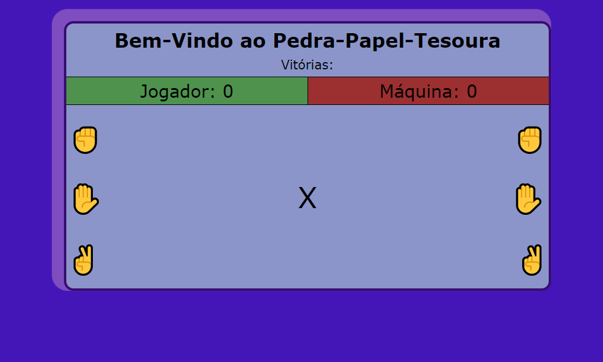

# Jogo de Pedra-Papel-Tesoura

Aplicação com os elementos possíveis do jogo real como opçao de jogada, podendo vencer, empatar.

Desenvolvi esse game com foco em ReactJs para construir a interface e JavaScript para fazer a parte funcional do game. Utilizei bastante Hooks e props do React nesse jogo e foi um bom projeto para aplicar os conceitos da Tecnologia.

Para jogar, basta acessar <a href="https://pedra-papel-tesoura-victorgarciadss.vercel.app/">esse link</a>

 

## Tecnologias Utilizadas

<ul>
    <li>ReactJs</li>
    <li>JavaScript</li>
    <li>CSS</li>
    
</ul>